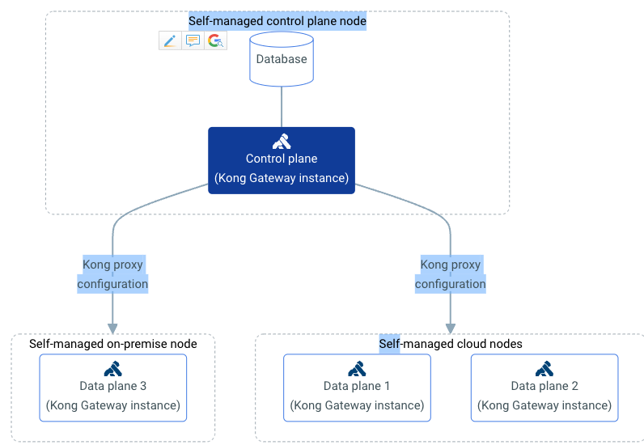
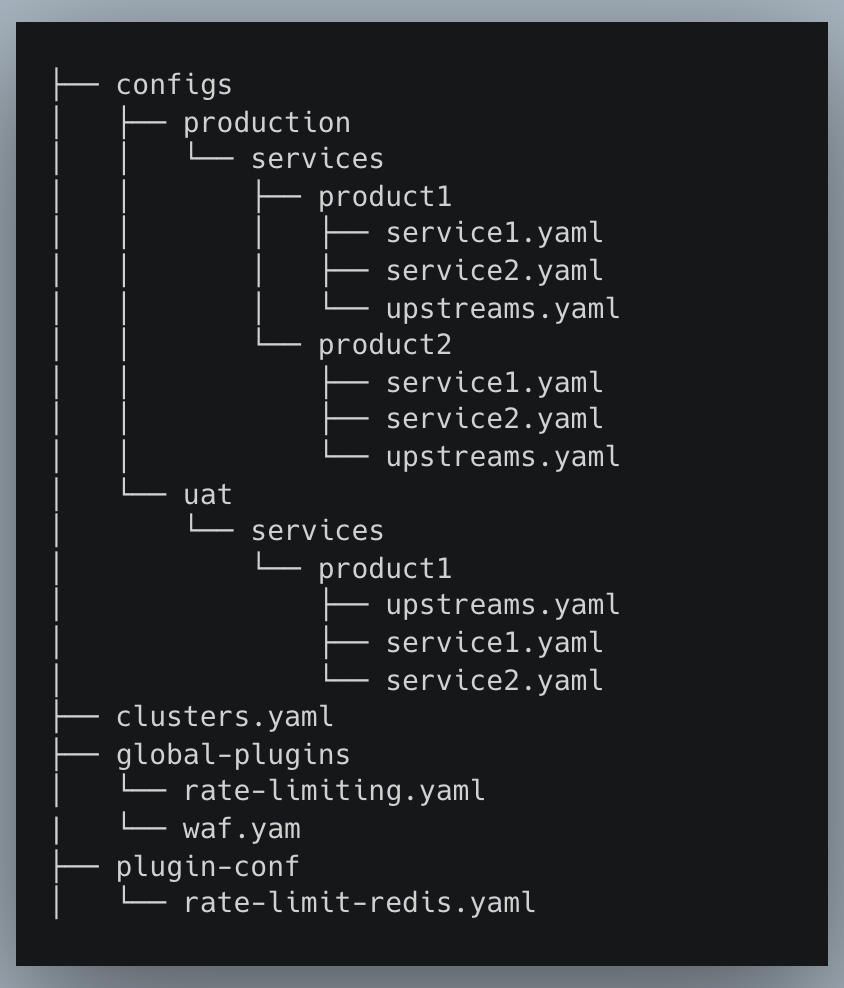
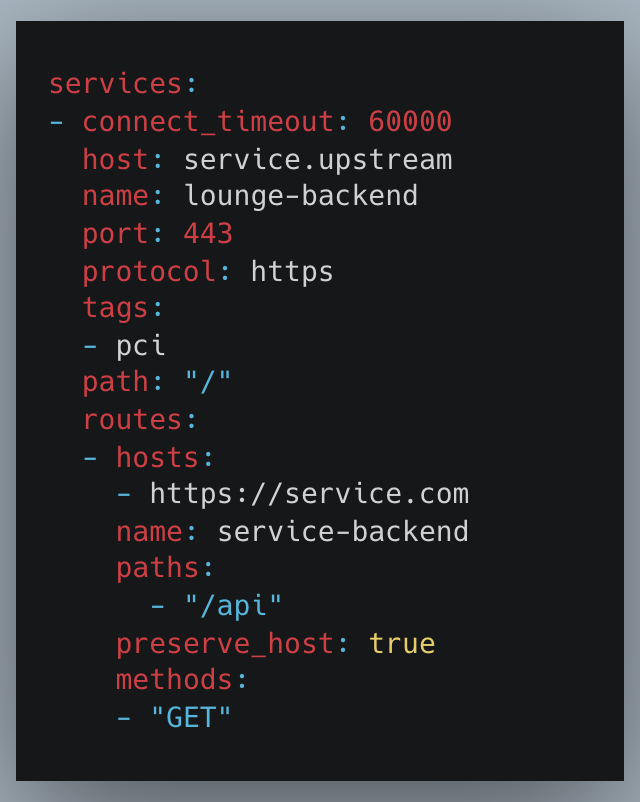
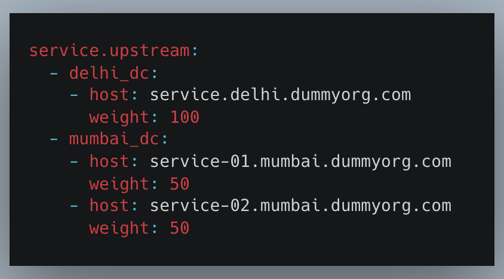
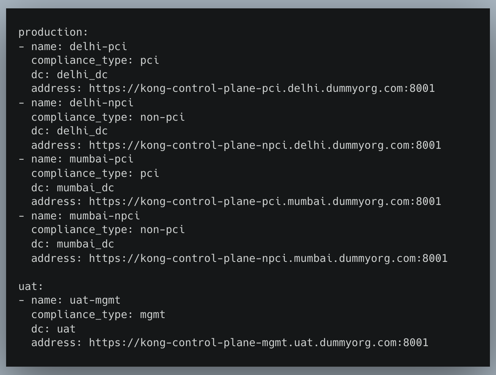

This project started as a requirement to solve the problem of maintaining multiple sources of truth for multi-regional Kong deployments which essentially needed to have parity in major components across services and routes across regions in the same environment.

Along with the above, there was a requirement for assigning services to specific Kong clusters depending on compliance types.

Hence, this document serves a project home for this piece of software/framework which can be used to control multiple Kong deployments with a single GitOps repo by following custom metadata to Kong declarative configuration.


## Goals

* **API Governance**: Achieve standardisation for APIs to keep them consistent throughout the org by having a single source of truth and
effectively manage the API lifecycle.

* **API Traffic Observability**: Monitor the traffic state (rate/error/duration) of Public APIs for all upstream services from a single dashboard.
* **Increased Availability**: Achieve higher uptime for all upstreams by using health-check based load balancing and auto failover strategies
across all the Infra.
*  **Developer Self-Service**: Enable the product teams to onboard APIs and manage the lifecycle for their products without admin intervention.
* **Service Equivalence across DCs**: Maintain the same set of Public API configurations along with upstream services across multiple
DCs.

## Terminology

* **Compliance Zone** : means the volume area covered by the compliance boundary line (Compliance boundary line is the boundary line
defining a volume area outside of that area where the exposure level is not exceeded).
* **DMZ, App & DB Zones**: 3-tier network zones for keeping outside traffic(DMZ), applications and databases in different networks for security and compliance purposes.

## First Principles

* **Traffic Segregation**: API Gateway should be deployed as separate instance per region and per compliance zone. For 2 regions with 2
compliance zones each, there will be 2 Gateway deployments for each zone for each of the 2
regions.
* **Service Equivalence**: The API gateway entities(services/routes/plugins) for each compliance zone should remain equivalent across
all the regions.
* **North-South Traffic**: All traffic leaving and entering the internal network at the API Gateway should be TLS encrypted.
* **Inter-Zone Communication**: All Inter-Zone communication should be TLS encrypted and routed via the Kong Data Plane nodes
through the Internal DMZ network.
* **Intra-Zone communication**: Intra-Zone communication can be either TLS encrypted or unencrypted on both PCI and non-PCI zones.

## High Level Architecture

### External API Gateway

The external API gateway in form of the Kong Gateway deployment will be designed keeping the first principles in mind and is detailed as
follows:

#### Deployment Model

Kong will be deployed in hybrid mode, i.e, Data Plane(DP) and Control Plane(CP) Nodes are deployed as separate entities along with a
PostgreSQL database used to manage and store configurations for that Kong instance and communicates with the CP nodes.



The hybrid mode is chosen because of the following reasons:


* **Increased Reliability**: Either of the CP or DB going down does not affect the traffic flowing through the Data Plane.
* **GitOps Management** : decK(Declarative Configuration) workflow works with DB-mode only, and hybrid mode is more resilient that
having Control and Data Plane on same nodes.
* **Lower attack surface area** : Just the Kong DP nodes will be exposed in the DMZ zone.
* **Horizontally Scalable**: DP and CP nodes can horizontally scaled out independently.

#### Service Equivalence

**Problem Statement**

Kong configurations entail all the information regarding upstream services, endpoints, API routes, plugins and so much more. But in the
context of service equivalence, only the service, route and other global entities are required to be replicated across multiple regions. Entities
like upstreams, certificates, consumers will vary from region to region.

Kong’s declarative configuration tool supports managing the configuration of only one Kong cluster at once. Hence, this calls for a custom
solution to manage and maintain the Kong configuration for multiple Kong Clusters in different regions from a single set of conventions.

The following sections will break down the problem and explore the solution in parts:

**GitOps Config Management**

**Folder Structure**

The Kong API configuration will be divided on the basis of environments, and each environment will have multiple cluster(s) across which
the API service/route configuration has to be kept equivalent.

The services will be further divided into separate products, such product teams can manage their own configurations while maintain a
boundary from other services.

There’ll be global entities like plugin and default kong configuration which’ll be merged with the generated Kong configuration.

**Simplified Explanation**
```
One Folder → One Environment
One Environment → Multiple Clusters
Multiple Clusters → Same Kong route config
Different Environments → Different Kong route configs
```

The folder structure of the Git Repo looks this:



**For e.g.,**

There are two Kong clusters mentioned inside the production environment across which routes have to be made equivalent.

There is a service defined named service1 inside product1. The service definition looks like this:



The compliance zone where the service belongs(PCI/Non-PCI) will be mentioned in the tags of the service itself.

This service has defined its upstream as servuce.upstream. Now, the goal is to replicate this service route across both clusters of
the environment.

So, the upstreams target configuration for this particular product will look like this:



The configurations will be generated separately for each of the clusters using the same service definition but substituting the cluster(DC)
specific upstream target configurations, maintaining service(route) equivalence across clusters of the same environment.



**Config Generation**

The requirement is to generate service configurations across multiple compliance zones and clusters in the same
environment and this will be achieved by a convention which’ll be maintained throughout the Git repo and a custom logic to segregate
services based on compliance zones and substituting upstream targets accordingly.


For the purpose of service equivalence and keeping a single source of truth, the Kong Manager UI will be disabled and all manual
changes to services/routes/upstreams will be prohibited.

decK will be used as the configuration management and drift detection tool to validate, diff and sync the configs on a single cluster. But route
equivalence will be achieved across multiple clusters as follows:

**Conventions**


* A service should have a tag of either PCI or Non-PCI which defines their compliance zone.
* A service upstream should define targets across all the DCs in an environment. A dummy backend can be used if service is still in the
process of onboarding.
* Upstream target weight for each DC must add up to 100.
Routes should not have specific tags as such, they’ll be replicated across all DCs of an environment.
* Canary based deployments should be carried through by updating upstream targets instead of routes.

As this is a very opinionated configuration template, these conventions will be validated across the repo structure and is mandatory to be followed for proceeding through the next stages of the pipeline.

**Generation Flow**


The service configurations will be segregated on the basis of PCI/Non-PCI compliance type and will be merge to create two separate
state maps for each compliance zone type for all the products.
The product level plugins(key-auth/jwt) will be merged with the product state maps.


The upstream target inventory will be used to create separate Kong state files for each of the products for all the clusters in that
environment.
The Kong State files for each compliance zone, and each region DC will be created after collating all the product state maps.


**Pipeline workflow**

Developers will onboard their APIs from a PR based workflow, where service onboarding/offboarding will require a signoff from their team
owners.

There’ll be one stage for each environment and pipelines for diff/validate stages will run on their branch, and after all approvers are taken for
the service onboarding/offboarding, the merge event will trigger a sync job with the respective Kong clusters.

There is a scope for race conditions during this workflow, but MRs will not allowed to merge unless the latest commit on master is pulled on
the given branch.

#### SSL Termination

For the APIs which require certificate based TLS/SSL authentication, TLS/SSL termination will happen at the Kong Gateway level itself.

The certificates and SNIs will be onboarded to Kong via APIs instead of doing it declaratively via Git repo for obvious security reasons.

The routes will be attached to SNIs during the service configuration declaratively in the Git repo.

-----------

Checkout more detailed docs and implementation of the configuration generation and environment validation tool at [Github](https://github.com/kumar1202/gojira).