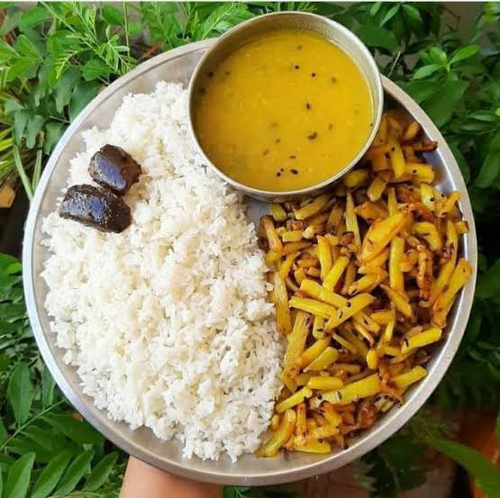

After a chaotic month of babysitting and attending family, I finally got some time for myself and sat down on the marble floor to eat a very famous Bihari staple dish called as Daal Bhat Bhujia, it's basically plain white rice which is cooked in a open pot, pulses of some kind cooked in a pressure cooker with a tempering of garlic, cumin, ghee and red chillis to give that smoky flavour and bhujiya which is shallow fried julienne potato strips.

This is how it looks on a good day.

As I was sitting down and eating a simple meal, the feeling of calmness ran through me and it felt like every cell in my body felt peace for a while. I was there eating with my hands in complete silence and haven't felt like that in almost a month.

I have a decision making framework based on feelings accumulated over a period of time for any activity that I do. Here's my best(kinda) to explain it:

Every person goes through good and bad times in their lives. I have a thought process with which I keep my life easy. If I go through a bad breakup, I know how it feels and I don't want to feel that ever again. But I also know how it feels to be loved, and I want to feel like that every single day.

But sometimes you need to go through the bad feelings so many damn times until you reach the good part, and the good part lasts for a while and then the cycle continues.

What I want to emphasize is that you will find things in this world which make you feel you a certain way which you want to be repeated again and again.

And there'll be things which will put you in a dark place, and you'll never ever want to feel like that again.

> It is your job to find out if there is a sunrise at the end of the climb or not, sometimes you'll have to cross many mountains and you'll still be deprived of the sunrise, but you'll indeed find it once in your life.

And once you have it, you should engrave everything in your mind about how you got there.

This is what happiness feels like, that sunrise and when we look back on the climb.

The climb is suffering, one must not give up the climb if you know for sure that there's a sunset at the end.

But there'll be times when you are climbing for far too long and the suffering becomes bigger than the happiness that you'd achieve on the summit. 
You should quit that climb and it is your job to find out for which climbs you will never reach the summit.

***

Okay, enough metaphors. Real life examples now.

A day of playful silence with kids on holidays and everyone spending a good time together along 8 hours of sleep, 2 hours of training and 4 hours of deep work(optional) is the sunrise for me.

But when you start a family, that sunrise is way far too long. 

Now, the climb has just begun. But you know that if everything goes right, there is a sunrise at the end of this climb.

In the age of social media, a man with a big house and fancy cars shows you his sunrise that he achieved after years of climbing, and you with the completely desensitised brain start thinking that a big house and fancy cars is your sunrise.

No, or maybe yes. But you need to embark on a journey of self discovery before you understand how your mind works and which things in life are your sunrise.

If you priortize the climb which won't lead to the sunrise you want, you will end up in a worse place than you start. On top of a mountain, alone and stranded, feels scary huh? That's exactly how it feels if you don't know what makes you happy and attempt someone else's climb.

And this already has a massive cascading effect in our society as nobody knows what makes them happy, they are following an influencer whose literal job is to influence and millons of people are falling prey.

> The foot of the wrong mountain is a better place than its summit. Remember that.

I will conclude this post with a lovely song which tells you exactly how loving someone is a mountain too.

<iframe width="560" height="315" src="https://www.youtube.com/embed/hysfqcPF3KU?si=wrgZzt4zCioxa6q0" title="YouTube video player" frameborder="0" allow="accelerometer; autoplay; clipboard-write; encrypted-media; gyroscope; picture-in-picture; web-share" referrerpolicy="strict-origin-when-cross-origin" allowfullscreen></iframe>

This isn't a "blogpost" but more of an observation after living a frustrating month of social media pressure and then finding peace after going back to what makes me happy.