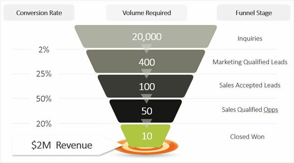
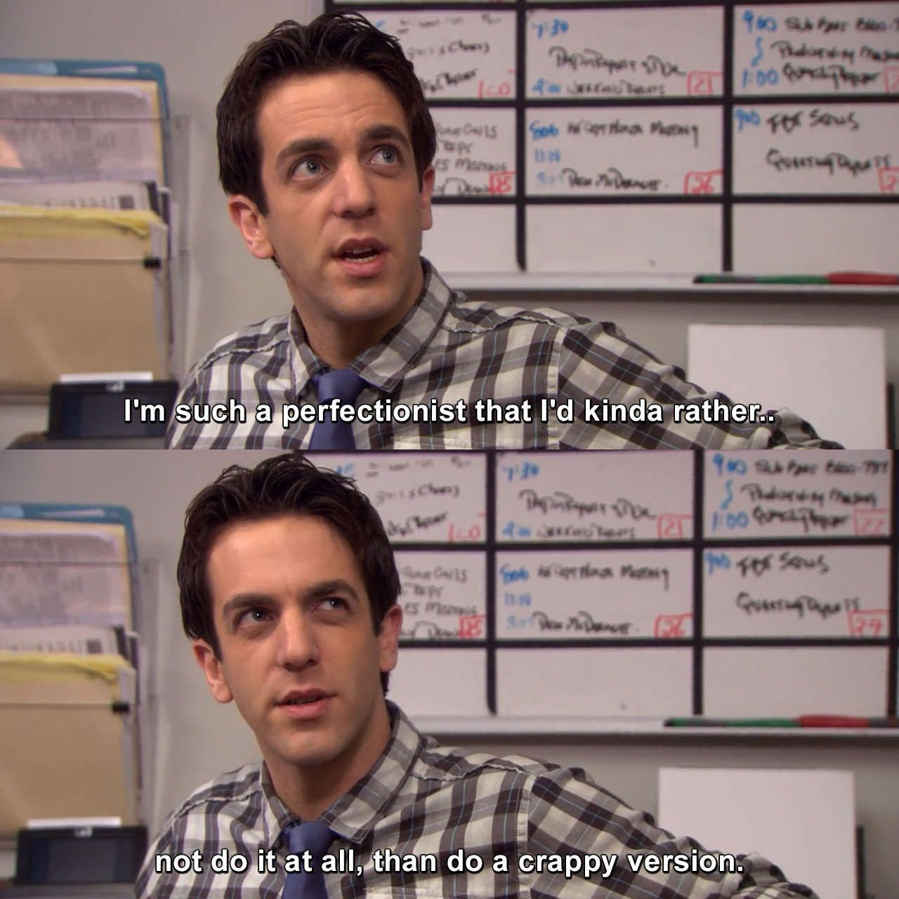

Do you struggle with pushing out content more frequently than you already planned? Do you always think, how the heck is your favorite creator able to finish such amazing content so fast?

**Spoiler Alert**: They don't. Creators who push out content more frequently usually don't strive for completion. They focus on publishing and then move on to the next project.

As a musician, I am extra critical of very minute aspects of my songs and it becomes pretty mentally draining as I progress through my process.

Let's take a sneak peek of a dialogue between my two alter-egos: the **perfectionist** who criticizes everything and the **artist** who wants to release his song.

**A**: I think the song is done and ready to publish.

**P**: Doesn't the power chords sound too loud? You should lower it. It'll improve the song.

**A**: Sure, I'll lower it.

**P**: I think the synths sound a little mellow. You should brighten it.

**A**: Sure, on it, anything to release my song. Making the synth brighter.

**P**: Hmm, it still doesn't sound like I want it to be. Let's spend some more time on the mix.

**A**: 🤕😓

By the end of this, the perfectionist still isn't happy and ruined the song.

Do you know how much time artists spend on average perfecting their art? More than a month, and that's just a gross estimation.

New artists deal with this perfectionist block more frequently than seasoned ones.

I once spent six months writing the chorus for a song, **SIX MONTHS!**

And after all this, the artist doesn't want to release the song anymore. Perfectionism makes some artists quit their art altogether.

So, how do we publish more and worry less about the nitty-gritty details that don't matter to the one who will eventually consume this content?

## Enter Funnels

The idea of funnels is picked up from a sales concept.

*A sales funnel is a visual representation of the journey from your prospect's first contact with you until a completed purchase.*

### Sales Funnel

The strategy with sales funnels is to blow out the inlet by getting the maximum number of sales leads and increasing the product's total revenue with more subscriptions/closed sales.

Now, roll the tape back a little bit, how can you maximize your productivity? Think of it as a funnel.

Few examples:

-   The more songs you'll publish, the higher the probability of your music getting viral or a Grammy.
-   The more videos you produce, the higher the probability of your video getting featured in your desired channel.
-   The more articles you'll publish, the higher the probability of one of your articles being featured in your favorite magazine.

If we put things in perspective, literally everything is a funnel.

From searching for a job to recruiting a VP, finding love to getting viral. **EVERYTHING IS A FUNNEL!**

### But how do I use these funnels?

Let's go back to the basics and define productivity. According to Wikipedia,

**Productivity** *is the efficiency of the production of goods or services expressed by some measure. Measurements of productivity are often expressed as a ratio of aggregate output to a single input or an aggregate input used in a production process, i.e. output per unit of input, typically over a specific period.*

I know you skipped that definition, but in short, it means the ratio between the Volume of Output and Input.

Thinking in funnels is more of a **mindset** than a strategy.

So, let's discuss more how you can build a mindset to use funnels and get the desired outcomes with your art/content.

Let's talk about input here; the input will be a function of time, energy, and money used in creating your content.

Input = f(time, energy, money) + luck

You can neglect luck from this situation as it's usually really low but adds up once you accumulate a lot of input/output volume.

Now, about output. Output is the final product, be it a 10 min video, a song, a mix, a podcast, anything.

To increase productivity, we need to hack the output/input ratio. Let's talk about a few cases here:

#### **Case #1: The Perfectionist**

If we **increase** the input volume, the productivity **decreases**.

The productivity further decreases if we increase the input volume and decrease the output volume.

This is a typical case of "I'm busy but I don't get much done". It's primarily due to procrastination caused by perfectionism, as we discussed above. Just like Ryan from The Office.

#### **Case #2: The Publisher**

Suppose we keep the input volume constant and **increase** the output volume, productivity **increases**.

This is achieved by focusing on **publishing** rather than completion. And the goal for a piece of art is never completed because it's impossible to complete and satisfy your perfectionist ego who always wants more.

The funnel comes into play now that you have increased your overall output volume. Optimize your outputs in a way to reach your desired target, and let the funnel do its magic.

---

I'll give a real-life example of how the funnel works.

Irving Berlin was a Russian-American composer and lyricist and is considered one of the greatest songwriters.

He published 1500 songs in his lifetime -> 25 of them were #1 Hits -> 12 got nominated for Awards -> Won 4 Awards

He once said that he wrote 10 songs for each song he published, which means he wrote 15,000 songs in his lifetime. He was a **funnel master**.

The conversion ratio of Awards to published songs is 0.026%, and he had no idea which songs would hit. He focused on publishing and distributing and left everything to the funnel.

The concept of "everything is a funnel" was inspired by a [talk](https://www.youtube.com/watch?utm_campaign=Perpetual%20Braindump&utm_medium=email&utm_source=Revue%20newsletter&v=5EuWCFCgy58) given by Jack Conte, the CEO of [Patreon](http://patreon.com/?utm_campaign=Perpetual%20Braindump&utm_medium=email&utm_source=Revue%20newsletter) and one-half of [Pomplamoose](http://youtube.com/channel/UCSiPjfAJBgbFlIUsxOWpK0w?utm_campaign=Perpetual%20Braindump&utm_medium=email&utm_source=Revue%20newsletter).

---

If you made this far, thank you for reading and please share the post and tag me if you liked it :)
